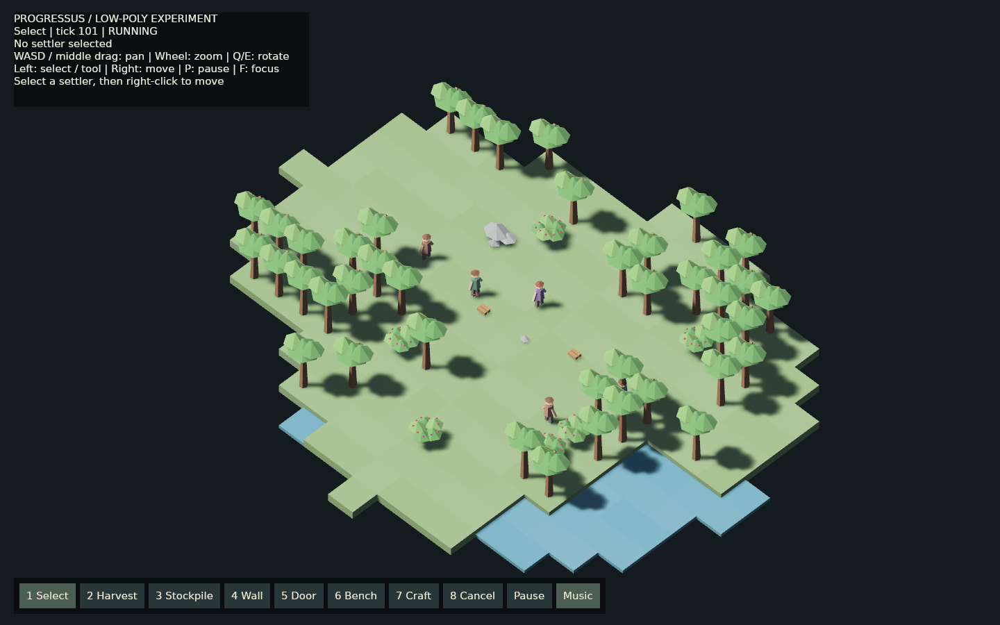
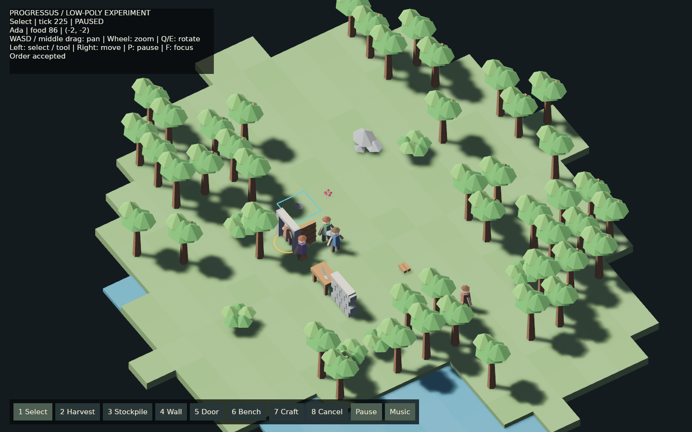
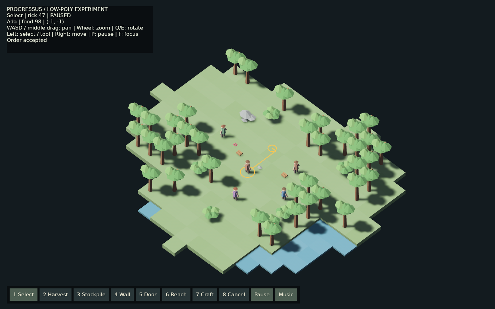

# Low-poly client experiment

This is an opt-in visual experiment, **not a decision to replace the 2D renderer**.
The authoritative world, navigation, jobs, fixed-point positions and saves remain
unchanged and two-dimensional. No 3D migration ADR is introduced.

## Run

```sh
# Existing client, with the accepted continuous neutral ambient music:
cargo run -p progressus-client --bin progressus-client

# Experimental client:
cargo run -p progressus-client --features low-poly --bin progressus-low-poly
# Different world or an existing compatible settlement:
cargo run -p progressus-client --features low-poly --bin progressus-low-poly -- --seed 73
cargo run -p progressus-client --features low-poly --bin progressus-low-poly -- --load /absolute/path/to/save.json
```

The window opens at the first settler. Left-click selects a visible settler;
right-click submits exact MoveTo. WASD/arrows and middle-button dragging pan,
wheel zooms, Q/E rotates, F focuses the selected settler, P pauses, Escape
returns to selection. The bottom toolbar and keys 1–8 select the tool. Build,
harvest and stockpile tools designate one cell per click. Craft issues one
PrimitiveTool job at the clicked real workbench. Cancel cancels construction.
The Music button toggles background music; the existing 2D sound menu retains
its separate music/effect level controls. A right-click exits an active tool
before a subsequent right-click sends a move order.

## Presentation

The second binary lives in the existing client crate behind `low-poly`, which
adds Bevy PBR/3D rendering. Keeping it there reuses the existing dependency
boundary and audio without introducing a common renderer framework. Its runtime,
HUD, camera, picking and scene synchronization are separate from the 2D client.
The application command/read model, tick scheduler, motion trace interpolator
and continuous music are reused.

World X/Y maps to local X/-Z. Heights only shape presentation: grass is flat,
water is slightly recessed, and rock cells have irregular raised triangular
centers. Integer origins are subtracted before conversion to floats and rebased
when the camera travels. A ground-plane ray becomes an exact fixed-point click;
settler picking measures distance to the displayed screen-space body, including
interpolated motion. Camera visibility never discovers terrain.

Terrain is one vertex-colored, flat-shaded mesh/entity per visible chunk.
Unknown cells emit no geometry. Detached chunk equality preserves mesh/entity
identity when exploration changes elsewhere. Meshes are explicitly removed on
replacement/eviction. Camera footprint plus a three-cell margin selects chunks;
terrain, item and resource reads have independent revision keys. Static models
are reconciled by ID/cell and exact detached state, with no full per-frame world
rebuild. Visible characters keep persistent disposable mappings and interpolate
their actual last-tick motion traces. Carried items follow their real carriers.

Procedural models use a bounded four-variant cache and one rough material:
branched trees with faceted crowns, rock clusters, berry bushes, clothed people,
physical item piles, tool-topped workbenches, masonry and timber doors, and cyan
construction scaffolds. These visuals do not consume simulation RNG.

## Audio

The accepted piano/strings timeline is rendered in finite windows on a worker.
Playback starts after prebuffering; a single stereo source consumes sequential
12-second blocks through a capacity-two queue. No file loop or wall-clock
crossfade restarts the score. Empty queues return silence without blocking the
mixer and discard equivalent late samples to preserve elapsed musical time.
Missing output disables playback and releases the source. Music is independent
of simulation pause, seed and save/load. Existing work-effect observation remains
in the 2D client.

## Scope and production implications

This HUD is deliberately smaller than the 2D client: English only, point tools,
no save-slot UI, stockpile filter editor, production-order modal, area dragging
or 3D work sound positioning. `--load` reads existing saves; the experiment does
not write them. Construction and production still use real physical logistics.
Wall/door visual connectivity and contextual occlusion need a production pass.
There is no animation rig, terrain LOD, production-scale rendering benchmark,
or claim of full UI parity. Per-resource entities and global application object
snapshots remain possible scaling limits beyond the current settlement.

Adopting this direction would replace the 2D camera/pointer conversion, terrain
raster composition, sprite registry and world overlays with their 3D equivalents.
HUD commands and application state do not need a simulation rewrite. The useful
seam is already `progressus-app`; reusable scheduler/interpolation/audio live
inside the existing client. Much of the current HUD references 2D render caches,
so reusing the whole HUD would require a deliberate smaller boundary extraction.
That extraction is not necessary to evaluate this experiment.

## Verification

Verified on 2026-09-10:

- `cargo test --workspace --features progressus-client/low-poly -j 1`: 279 tests passed, including 98 client library tests.
- Strict workspace Clippy with all targets and the 3D feature passed.
- `./scripts/check-prototype-01.sh`: passed formatting, default 2D checks, headless/application tests, dependency guards, 100k idle ticks, travel64 and 100k activity with save/load while carrying physical items.
- Native 2D and 3D windows rendered successfully. The isolated Xvfb check used Mesa llvmpipe because this display does not provide the DRI3 surface required by the Radeon Vulkan driver. The ordinary desktop 3D launch also rendered on Radeon. These are visual smoke checks, not a production performance benchmark.
- Mouse selection, exact MoveTo route/arrival, pause/resume, point tools, stockpile outline, pan, wheel zoom and camera rotation were exercised. In the real simulation, workers delivered materials and replaced wall/door scaffolds with completed structures. The 2D save modal wrote a compatible test save in an isolated temporary data directory; the experimental client successfully loaded that same file through `--load` and resumed its simulation.
- Convex primitive winding was initially wrong in prisms and gems. A regression first failed with `prism: inward triangle`; the corrected triangle order passes outward-winding and outward-normal checks. Back-face culling remains enabled.
- Runtime audio tests cover queued continuity, nonblocking starvation, elapsed-sample recovery, mute, missing-output cleanup and agreement between independent render windows near six hours. A final subjective listening verdict is not replaced by these tests.

The first capture is the final native Radeon build, including the corrected winding and berries intersecting crown facets. The remaining captures record the preceding interactive construction/navigation checks.






